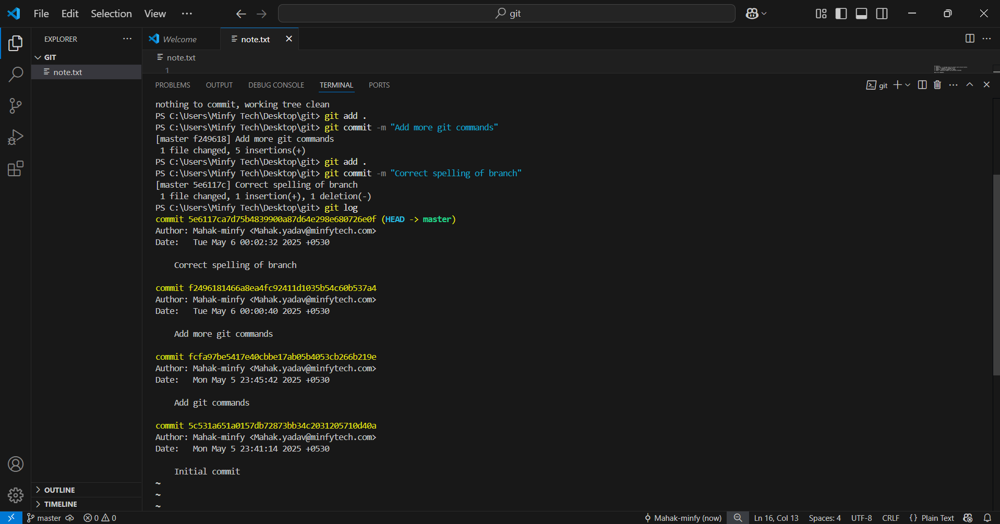

# GitHub Assignment
### Steps Completed  
1. Initialized local git repo
2. Created "note.txt" with Git basics
3. Made inital commit
4. Implemented 3 separate changes
5. Used "git log" to view history

