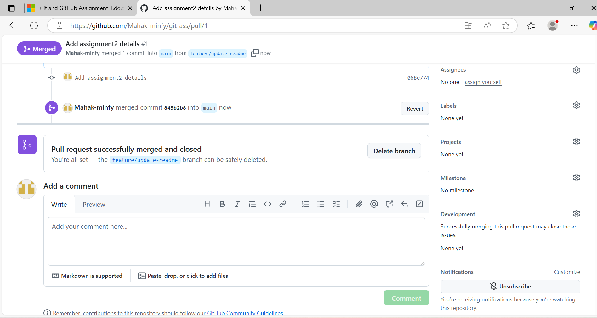

# GitHub Assignment
### Steps Completed  
1. Initialized local git repo
2. Created "note.txt" with Git basics
3. Made inital commit
4. Implemented 3 separate changes
5. Used "git log" to view history

### Explanation of changes in each commit 
1. Inital commit : Created "note.txt" with 5 basic lines about Github
2. Add git commands
3.  Add more git commands
4.  Fixed a typo where "branches" was corrected to "branch"

## Assignment 2: Github Basics 

